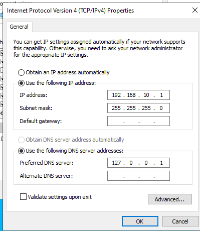
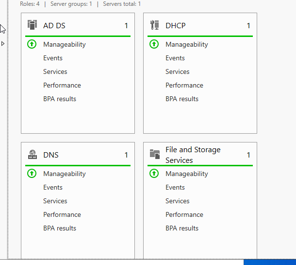
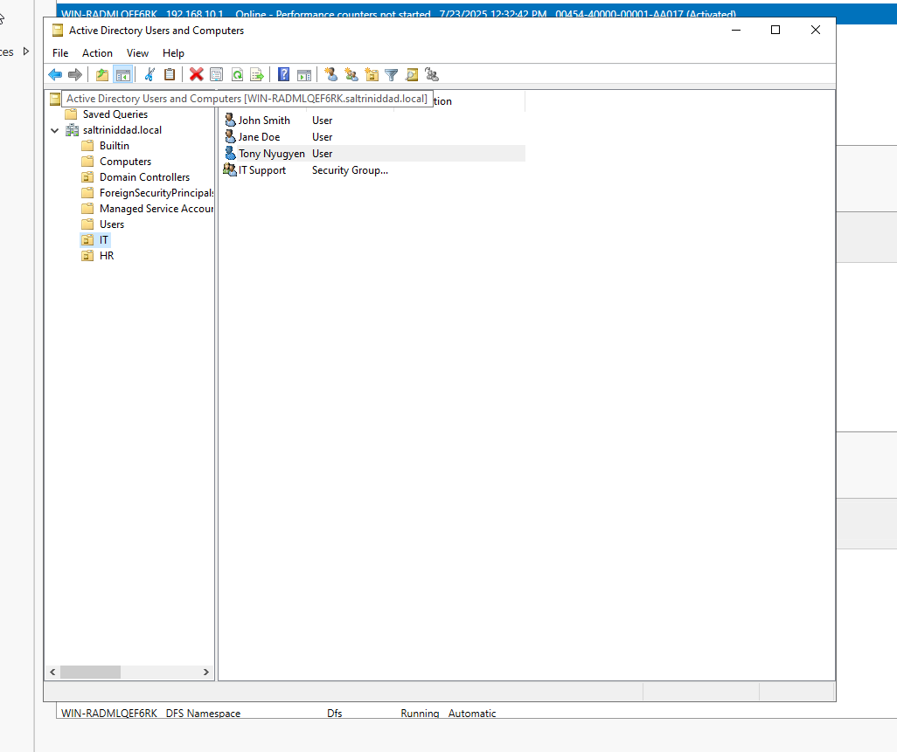
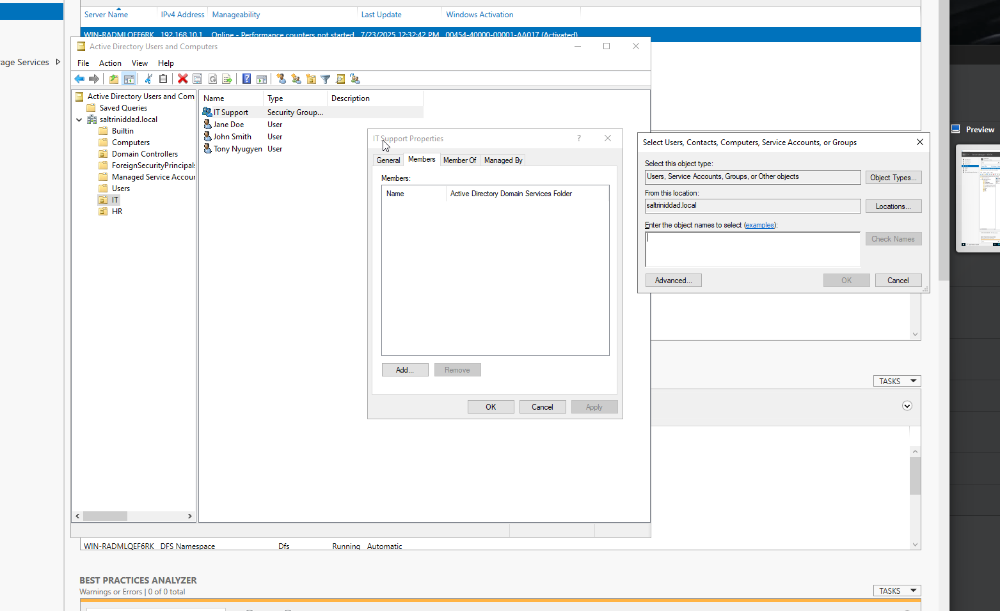
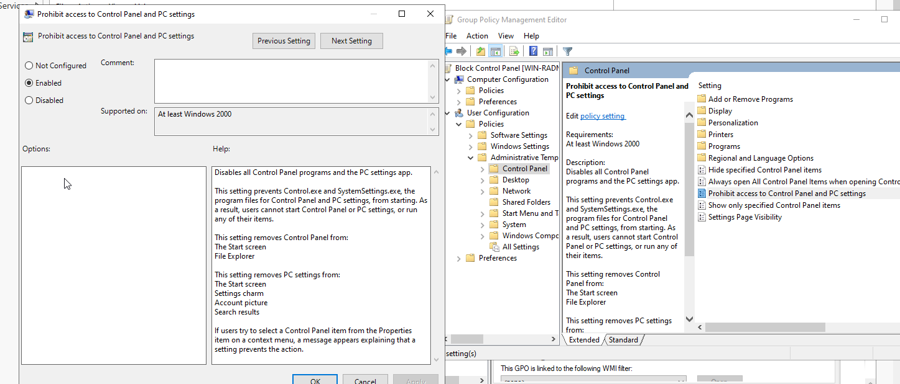

# Active Directory User Management Lab

## Overview
This lab simulates a basic enterprise environment using Windows Server 2022 and VirtualBox. It demonstrates how to deploy a domain controller, organize users into OUs, configure security groups, and enforce restrictions using Group Policy Objects (GPOs).

## Objectives
- Promote a Windows Server to a Domain Controller (`saltrinidadad.local`)
- Create Organizational Units (OUs): `IT` and `HR`
- Add users and security groups within OUs
- Apply Group Policy to restrict access to Control Panel for users in the IT OU

## Tools Used
- VirtualBox
- Windows Server 2022 (with Desktop Experience)
- Active Directory Domain Services (AD DS)
- Group Policy Management Console (GPMC)

---

## Key Actions Taken
1. Configured a static IP address on the Windows Server
2. Installed AD DS role and promoted the server to the `saltrinidadad.local` domain
3. Created two Organizational Units: `IT` and `HR`
4. Created three users (`JohnSmith`, `JaneDoe`, `TonyNguyen`) and a security group `IT Support`
5. Added `JohnSmith` and `JaneDoe` to the `IT Support` group
6. Created and linked a GPO to the IT OU that blocks Control Panel access

---

## Screenshots

| Step | Description |
|------|-------------|
|  | Static IP Configuration |
|  | Domain Controller Setup |
|  | Organizational Units |
|  | Users and Security Group |
|  | GPO Restricting Control Panel |

---

## Outcome
Successfully deployed a Windows Server domain environment with AD DS. Created and organized users in OUs, added a security group, and enforced a GPO to block Control Panel access for IT users. This lab demonstrates foundational Active Directory and Group Policy skills relevant to IT support and sysadmin roles.

